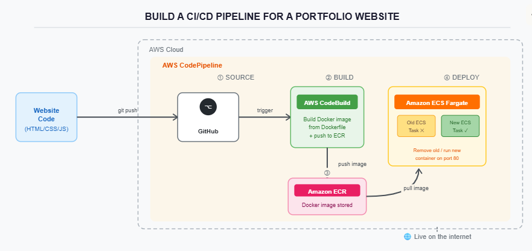
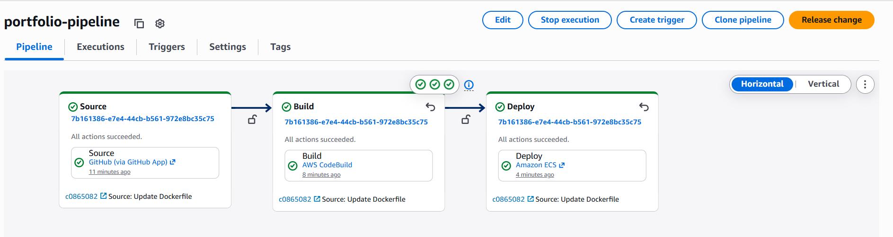
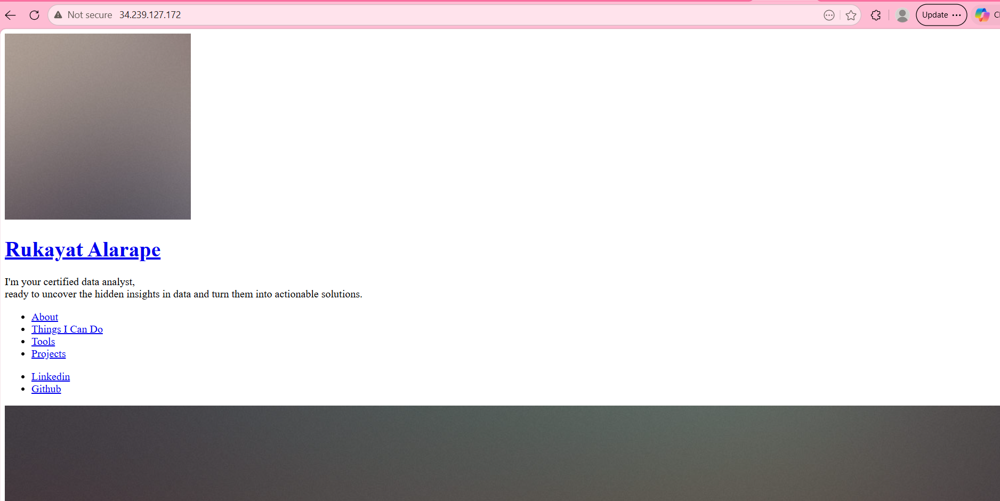
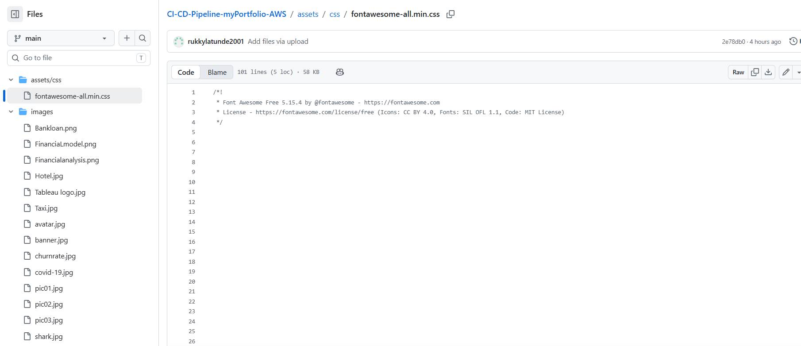
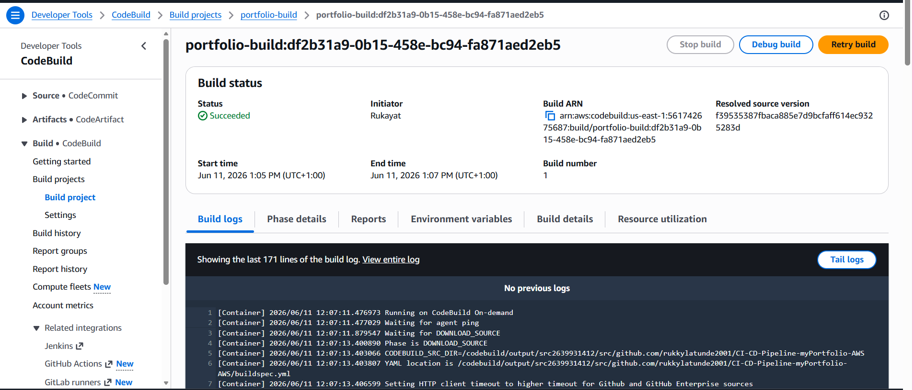
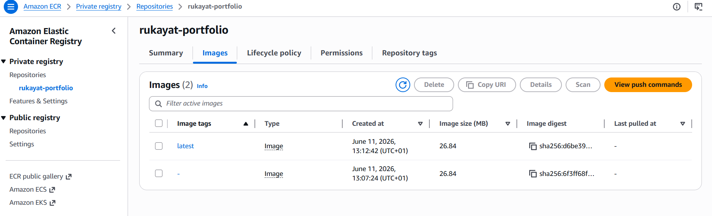
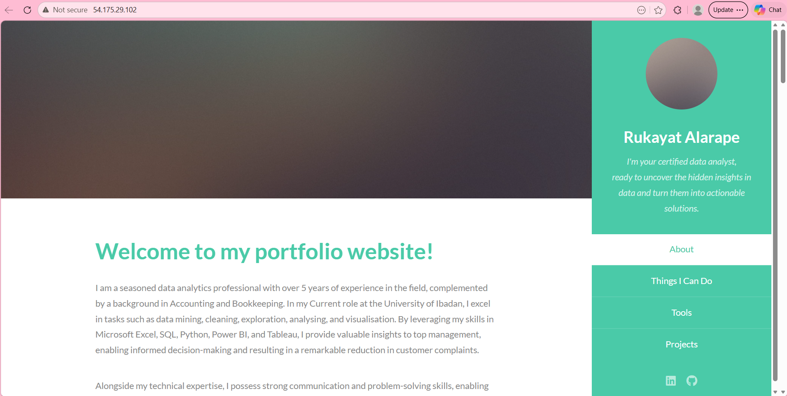

# CI/CD Pipeline — Portfolio Website Deployment on AWS


A fully automated CI/CD pipeline built on AWS that detects code changes on GitHub, builds a Dockerised static portfolio website, and deploys it to Amazon ECS Fargate — with zero manual steps after the initial setup.

> **"Every push to GitHub automatically builds a new Docker image, pushes it to ECR, and deploys an updated container to ECS — no manual steps required."**

---

## Architecture



Website source code lives in a GitHub repository. Every push to the `main` branch triggers **AWS CodePipeline** via a GitHub App connection. The pipeline runs three automated stages:

- **① Source** — CodePipeline detects the push and pulls the latest code from GitHub.
- **② Build** — AWS CodeBuild reads `buildspec.yml`, builds a Docker image using nginx, and pushes it to **Amazon ECR**.
- **③ ECR** — The new Docker image is stored in the private registry.
- **④ Deploy** — Amazon ECS Fargate pulls the new image, removes the old container, and launches the updated website live on the internet.

---

## AWS Services Used

| Service | Purpose |
|---|---|
| **GitHub** | Source control — pipeline triggers on every push to `main` |
| **AWS CodePipeline** | Orchestrates the full Source → Build → Deploy workflow |
| **AWS CodeBuild** | Builds the Docker image and pushes it to ECR |
| **Amazon ECR** | Private Docker image registry — stores every built image |
| **Amazon ECS Fargate** | Runs the containerised website serverlessly (no EC2 to manage) |
| **AWS IAM** | Manages secure permissions between all services |
| **Amazon CloudWatch** | Stores CodeBuild logs for debugging |

---

## Key Files in This Repository

| File | Purpose |
|---|---|
| `Dockerfile` | Builds the Docker image using nginx as the web server |
| `buildspec.yml` | Tells CodeBuild how to build, tag, and push the Docker image |
| `index.html` | Portfolio homepage |
| `assets/` | CSS, JavaScript, Sass, and web fonts |
| `images/` | Project images used in the portfolio |

---

## How It Was Built — Step by Step

### Step 1 — Set Up the GitHub Repository

Created a public GitHub repository named `CI-CD-Pipeline-myPortfolio-AWS` and uploaded all portfolio files directly via the GitHub web interface — no local Git commands needed. Files uploaded: `index.html`, `assets/`, `images/`, `Dockerfile`, and `buildspec.yml`.

The `Dockerfile` uses `public.ecr.aws/nginx/nginx:alpine` as the base image (AWS's own public registry — avoids Docker Hub rate limits), copies all portfolio files into the nginx web root, and starts nginx on port 80.

The `buildspec.yml` contains three phases that CodeBuild will execute:
- **pre_build** — Logs into ECR using `aws ecr get-login-password`
- **build** — Runs `docker build` and `docker tag` with the ECR URI
- **post_build** — Pushes the image to ECR and creates `imagedefinitions.json` for ECS

---

### Step 2 — Create the ECR Repository

In AWS ECR, created a private repository named `rukayat-portfolio` in `us-east-1`. This is the storage space where every Docker image built by CodeBuild gets saved. The repository URI was copied and used to replace the placeholder values in `buildspec.yml`.

---

### Step 3 — Create IAM Roles and Permissions

In AWS IAM, created a role named `CodeBuildPortfolioRole` trusted by `codebuild.amazonaws.com`. Attached the following managed policies:

- `AmazonEC2ContainerRegistryFullAccess` — allows CodeBuild to push images to ECR
- `AWSCodeBuildDeveloperAccess`
- `AmazonS3FullAccess`

Added a custom inline policy to allow `ecs:UpdateService` and `ecs:DescribeServices` so CodeBuild can interact with the ECS service after deployment.

---

### Step 4 — Set Up AWS CodeBuild

In AWS CodeBuild, created a project named `portfolio-build` connected to the GitHub repository. Key settings:

- Environment image: `aws/codebuild/standard:7.0` on Ubuntu
- **Privileged mode: enabled** — this is required for Docker builds inside CodeBuild. Without it, the `docker build` command fails immediately.
- Service role: `CodeBuildPortfolioRole`
- Buildspec: uses the `buildspec.yml` file at the root of the repository

Triggered the build **once manually** before setting up ECS. This created the first Docker image and pushed it to ECR — ECS cannot create a Task Definition without at least one image already in the registry.

---

### Step 5 — Set Up Amazon ECS (Cluster, Task Definition, Service)

**Cluster:** Created a cluster named `portfolio-cluster` using AWS Fargate (serverless — no servers to manage).

**Task Definition:** Created `portfolio-task` with the following:
- Container name: `portfolio-container` *(must match the name in `imagedefinitions.json` exactly)*
- Image: ECR URI with `:latest`
- Port mapping: 80/TCP
- CPU: 0.25 vCPU | Memory: 0.5 GB

**Service:** Created `portfolio-service` inside the cluster with 1 desired task, the default VPC, public subnets, a security group allowing inbound port 80, and auto-assign public IP turned on. The public IP is the address used to visit the live website.

---

### Step 6 — Create the CodePipeline

In AWS CodePipeline, created a pipeline named `portfolio-pipeline` connecting all three stages:

- **Source** — GitHub (via GitHub App), repository `CI-CD-Pipeline-myPortfolio-AWS`, branch `main`
- **Build** — AWS CodeBuild project `portfolio-build`
- **Deploy** — Amazon ECS, cluster `portfolio-cluster`, service `portfolio-service`, image definitions file `imagedefinitions.json`

The pipeline triggers automatically on every push to the `main` branch.

---

## Testing the Pipeline — End-to-End Proof

With the pipeline set up, the real test was to push a change to GitHub and verify that the live website updated automatically without any manual steps.

### First Run — Pipeline Triggered

After the CodePipeline was created, it ran immediately. All three stages — Source, Build, and Deploy — completed successfully.



The pipeline confirmed that code from GitHub was fetched, a Docker image was built and deployed to ECS, all automatically.

---

### First Visit — Website Loaded Without Styling

The ECS task was running and assigned a public IP. Visiting the IP in the browser loaded the website — but something was wrong. The page appeared completely unstyled: no colours, no layout, no fonts.



The HTML content was loading correctly, but the CSS was missing. This meant the pipeline itself was working — it successfully deployed whatever was on GitHub — but the source files were incomplete.

---

### Investigating the Cause — Missing Asset Files

Checking the GitHub repository revealed the problem. Inside `assets/css/`, only `fontawesome-all.min.css` had been uploaded. The main stylesheet (`main.css`), JavaScript folder (`js/`), Sass files (`sass/`), and web fonts (`webfonts/`) were all missing from the repository.



The Docker image faithfully packaged whatever was in the repository — which did not include the CSS needed to style the page. This was not a pipeline error. It was a source error.

---

### The Fix — Upload the Complete Assets Folder

The full `assets/` folder was uploaded to GitHub including `main.css`, `js/`, `sass/`, and `webfonts/`. Committing this to the `main` branch **automatically triggered the pipeline** — no manual action needed.

---

### Automated Rebuild — CodeBuild Succeeded

CodeBuild detected the new commit and ran the full build again. The Docker image now contained the complete assets folder.



---

### New Image Stored in ECR

After the build, ECR showed a new image tagged `latest` alongside the previous one — confirming the updated image was successfully pushed.



---

### Final Result — Website Loads Correctly

ECS deployed the new container automatically. Visiting the public IP now showed the portfolio with full styling, layout, navigation, and fonts — exactly as designed.



This confirmed the full CI/CD loop: **a fix on GitHub → automatic rebuild → automatic deployment → live update.**

---

## Troubleshooting & Lessons Learned

**Docker Hub rate limiting — `toomanyrequests` error**
The Dockerfile originally used `FROM nginx:alpine` which pulls from Docker Hub. CodeBuild's shared AWS IP addresses hit Docker Hub's unauthenticated pull rate limit, causing the build to fail in under a second. Fixed by switching to `FROM public.ecr.aws/nginx/nginx:alpine` — AWS's own public registry with no rate limits.

**Webhook creation failed in CodeBuild**
The GitHub connection was broken, causing the webhook setup to fail. Fixed by unchecking the webhook option in CodeBuild — CodePipeline handles source triggering through its own GitHub App connection.

**ECS cluster creation failed — service-linked role error**
Cluster creation failed with "Unable to assume the service linked role". Fixed by running one command in AWS CloudShell (no local installation needed):
```
aws iam create-service-linked-role --aws-service-name ecs.amazonaws.com
```

**CloudFormation stack conflict**
The failed cluster attempt left a broken CloudFormation stack. Fixed by deleting it in the CloudFormation console, then recreating the cluster.

**Privileged mode required for Docker builds**
The build phase failed instantly. Fixed by editing the CodeBuild project → Environment → Additional Configuration → ticking the **Privileged** checkbox.

**ECR access denied during `docker push`**
Fixed by attaching `AmazonEC2ContainerRegistryFullAccess` to `CodeBuildPortfolioRole` and adding a repository-level permissions policy on the ECR repository.

**"Retry" does not pick up new commits**
Clicking "Retry" on a failed stage reuses the old cached source. The correct action is **"Release change"** from the pipeline view — this forces CodePipeline to fetch the latest code from GitHub before building.

---

## About the Author

**Rukayat Alarape**
Data Analyst | Cloud Engineer Learner

- GitHub: [@rukkylatunde2001](https://github.com/rukkylatunde2001)
- Email: rukkylatunde2001@gmail.com
